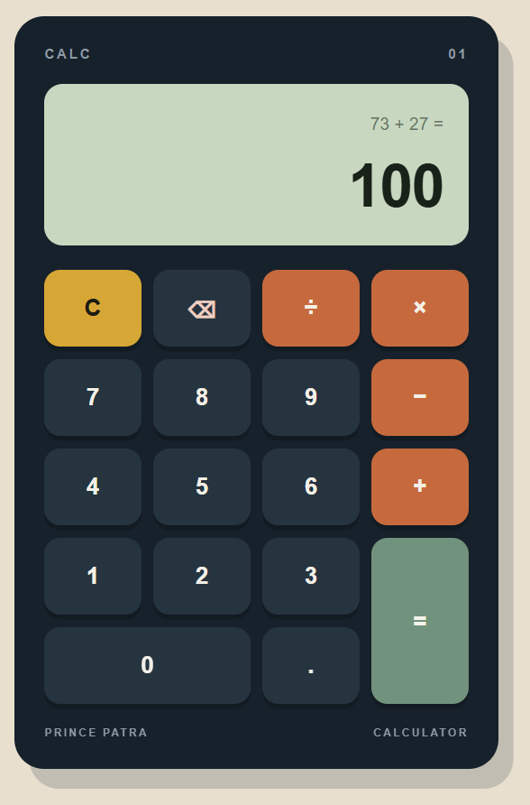
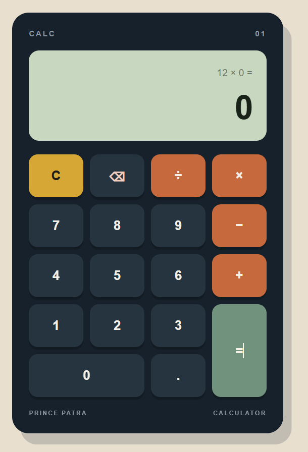
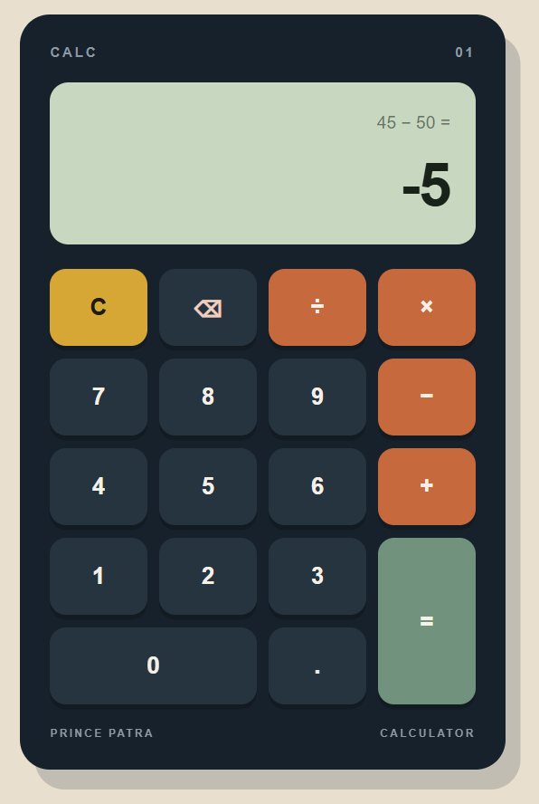
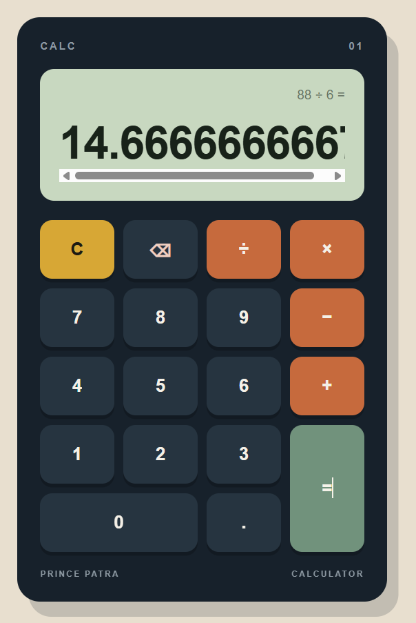

# 🧮 Calculator

A fully functional, responsive browser-based calculator built using **HTML5, CSS3, and Vanilla JavaScript**.

The project focuses on building calculator functionality from scratch without using `eval()`, while maintaining a clean, responsive, and user-friendly interface.

## 📸 Preview

<div align="center">

    <table>
        <tr>
        <td></td>
        <td></td>
        </tr>
        <tr>
        <td></td>
        <td></td>
        </tr>
    </table>

</div>

## ✨ Features

- 🔢 Numeric buttons from 0–9
- 🔸 Decimal point support
- ➕ Addition
- ➖ Subtraction
- ✖️ Multiplication
- ➗ Division
- 🟰 Result calculation
- 🧹 Clear button to reset the calculator
- ⌫ Backspace button to remove the last character
- 🚫 Division-by-zero protection
- 🔗 Sequential operator operations
- 📊 Separate expression and result display
- 📱 Fully responsive design
- 🖱️ Button-based user interface
- ⚡ Event listeners used for all calculator interactions
- 🚫 No `eval()` used

## 🛠️ Tech Stack

- **HTML5** — Structure and calculator interface
- **CSS3** — Styling, CSS Grid layout, responsive design, and button interactions
- **Vanilla JavaScript** — Calculator logic, DOM manipulation, event handling, and validation

## 🧠 JavaScript Concepts Practiced

This project helped me practice several core JavaScript concepts:

- DOM selection using `getElementById()` and `querySelectorAll()`
- `addEventListener()`
- Functions
- Variables and state management
- `if...else` conditional logic
- `parseFloat()`
- String manipulation
- `slice()`
- `dataset` attributes
- Number formatting
- Error handling
- CSS Grid integration with JavaScript

## 🚫 No `eval()`

This calculator intentionally does **not** use JavaScript's `eval()` function.

Instead, calculations are performed using stored values and conditional logic.

For example:

```javascript
if (operator === "+") {
    result = firstNumber + secondNumber;
} else if (operator === "-") {
    result = firstNumber - secondNumber;
} else if (operator === "*") {
    result = firstNumber * secondNumber;
} else if (operator === "/") {
    result = firstNumber / secondNumber;
}