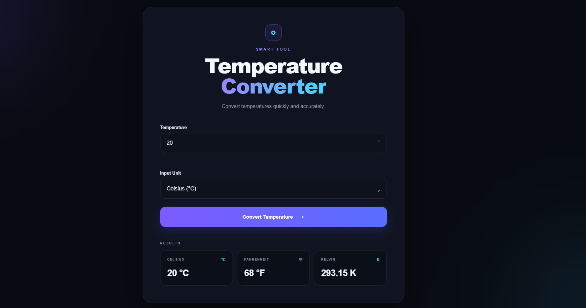

# 🌡️ Temperature Converter

A clean, responsive temperature converter built with **HTML5, CSS3, and Vanilla JavaScript**.

The tool allows users to convert temperatures between **Celsius, Fahrenheit, and Kelvin** with real-time validation and absolute-zero error handling.

## 📸 Preview



> Replace `preview.png` with the actual name/path of the screenshot you add to your repository.

## ✨ Features

- 🌡️ Convert between Celsius, Fahrenheit, and Kelvin
- 🔢 Numeric temperature input
- ⚡ Instant conversion on button click
- ✅ Input validation for invalid values
- 🚫 Absolute zero validation
- 📊 Displays all converted values simultaneously
- 🎨 Modern dark glassmorphism-inspired UI
- 📱 Fully responsive design
- 🖥️ Works across desktop, tablet, and mobile devices
- ✨ Smooth hover and focus interactions

## 🛠️ Tech Stack

- **HTML5** — Structure and semantic markup
- **CSS3** — Styling, responsive layout, animations, and visual effects
- **JavaScript (Vanilla)** — Conversion logic and input validation

## 🌡️ Supported Conversions

### Celsius

- Fahrenheit = `(C × 9/5) + 32`
- Kelvin = `C + 273.15`

### Fahrenheit

- Celsius = `(F − 32) × 5/9`
- Kelvin = `(F − 32) × 5/9 + 273.15`

### Kelvin

- Celsius = `K − 273.15`
- Fahrenheit = `(K − 273.15) × 9/5 + 32`

## 🚨 Validation

The converter handles invalid temperature values and displays user-friendly error messages.

Examples:

- Empty input → `Please enter a temperature.`
- Invalid numeric value → `Please enter a valid numeric value.`
- Temperature below absolute zero → `Temperature cannot be below absolute zero (-273.15°C).`

Absolute zero limits:

| Unit | Minimum Value |
|---|---:|
| Celsius | -273.15°C |
| Fahrenheit | -459.67°F |
| Kelvin | 0 K |

## 📱 Responsive Design

The interface is designed to work smoothly across different screen sizes:

- 💻 Desktop
- 💻 Laptop
- 📱 Tablet
- 📱 Mobile

The result cards automatically adjust based on the available screen width.

## 📂 Project Structure

```text
temperature-converter/
│
├── index.html
├── style.css
├── script.js
├── preview.png
└── README.md