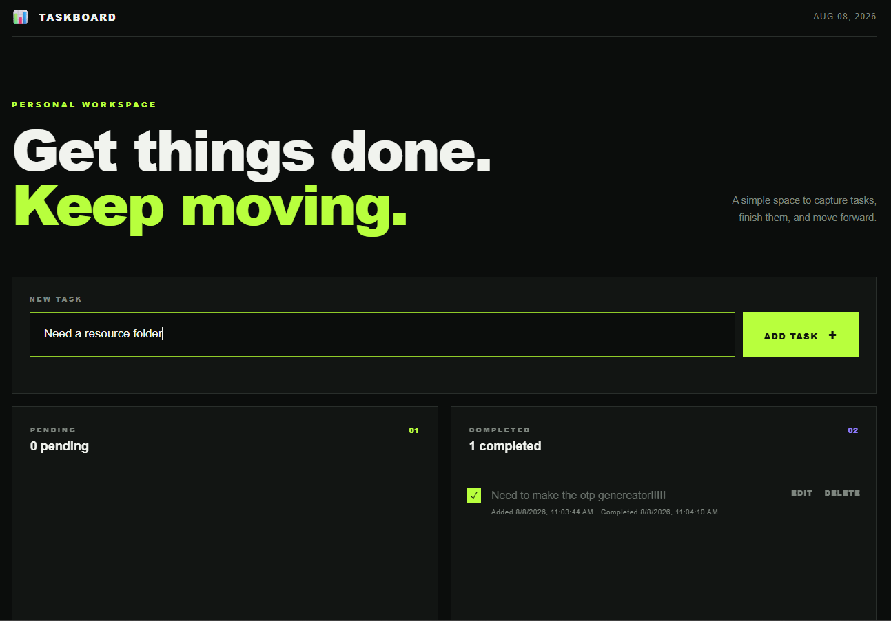
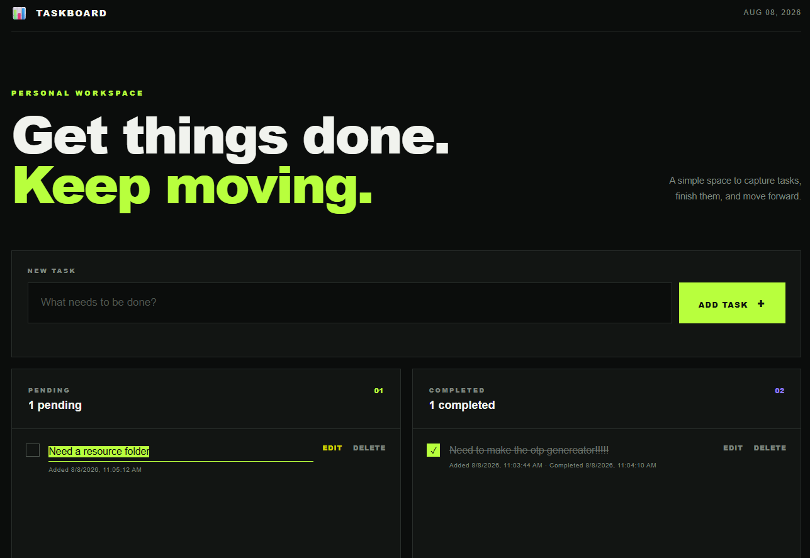
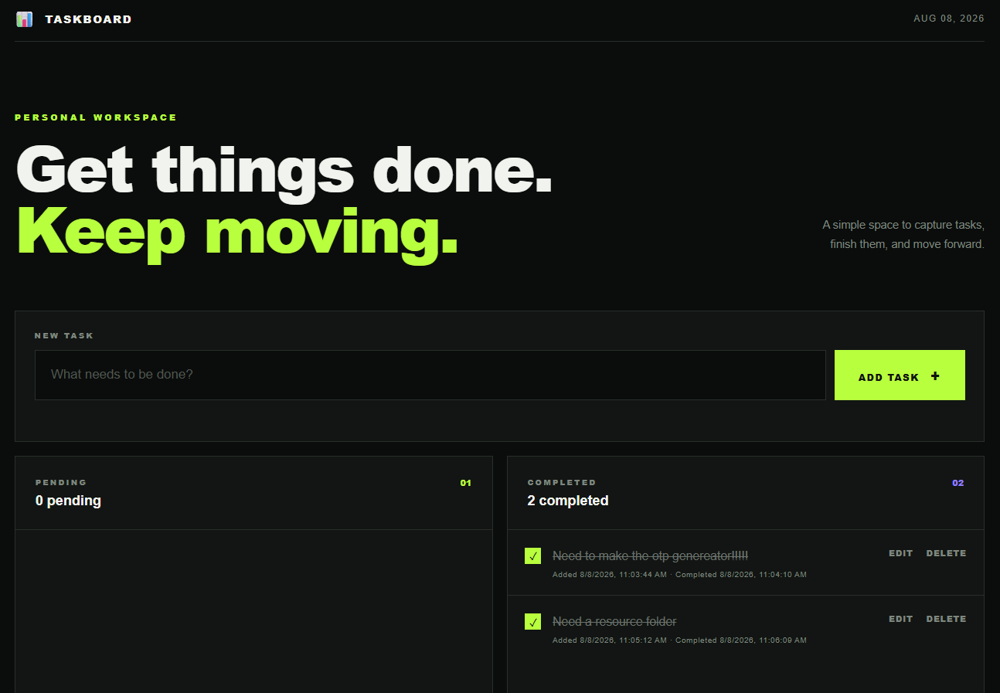

# 📊 TASKBOARD

### 📝 A minimal, responsive task management application built with Vanilla JavaScript.

Taskboard is a browser-based **To-Do Web App** designed around a simple idea:

> 🎯 Capture the task. Get it done. Move forward.

It provides a focused workspace for managing **pending and completed tasks** while keeping the interface clean, responsive, and easy to use.

---

## 📸 Preview

<div align="center">



<br><br>



<br><br>



</div>

---

## ✨ Features

| Feature | Description |
|---|---|
| ➕ Add Tasks | Create new tasks from the input field |
| ✅ Complete Tasks | Move tasks from Pending to Completed |
| ✏️ Edit Tasks | Modify task text directly inside the task list |
| 🗑️ Delete Tasks | Permanently remove tasks |
| 🔢 Task Counters | Track pending and completed task totals |
| 🕒 Timestamps | Record when tasks were created and completed |
| 💾 Persistent Data | Keep tasks after refreshing the browser |
| 📭 Empty States | Display friendly messages when lists are empty |
| 📱 Responsive UI | Adapt the interface to desktop, tablet, and mobile |

---

## 🚀 What You Can Do

### ➕ Add Tasks

Enter a task and press **ADD TASK** or hit `Enter`.

The new task is immediately added to the **Pending Tasks** section.

### ✅ Complete Tasks

Each pending task has a completion control.

When selected:

```text
📋 PENDING
      ↓
   ✅ COMPLETE
      ↓
🏆 COMPLETED